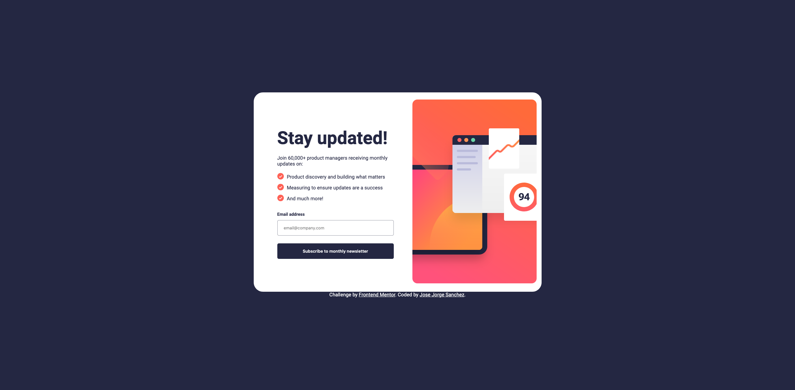

# Frontend Mentor - Newsletter sign-up form with success message solution

This is a solution to the [Newsletter sign-up form with success message challenge on Frontend Mentor](https://www.frontendmentor.io/challenges/newsletter-signup-form-with-success-message-3FC1AZbNrv). Frontend Mentor challenges help you improve your coding skills by building realistic projects. 

### Screenshot

### Links

- Solution URL: [Add solution URL here](https://www.frontendmentor.io/solutions/newsletter-sign-up-with-success-message-main-yvpN4HmDSU)
- Live Site URL: [Add live site URL here](https://newsletter-sign-up-with-success-jorge.netlify.app/)

### Built with

- Semantic HTML5 markup
- CSS custom properties
- Flexbox
- CSS Grid
- Mobile-first workflow
- [Styled Components](https://styled-components.com/) - For styles

## Author

- Website - [Add your name here](https://github.com/fcojsanchez55)
- Frontend Mentor - [@yourusername](https://www.frontendmentor.io/profile/fcojsanchez55)

